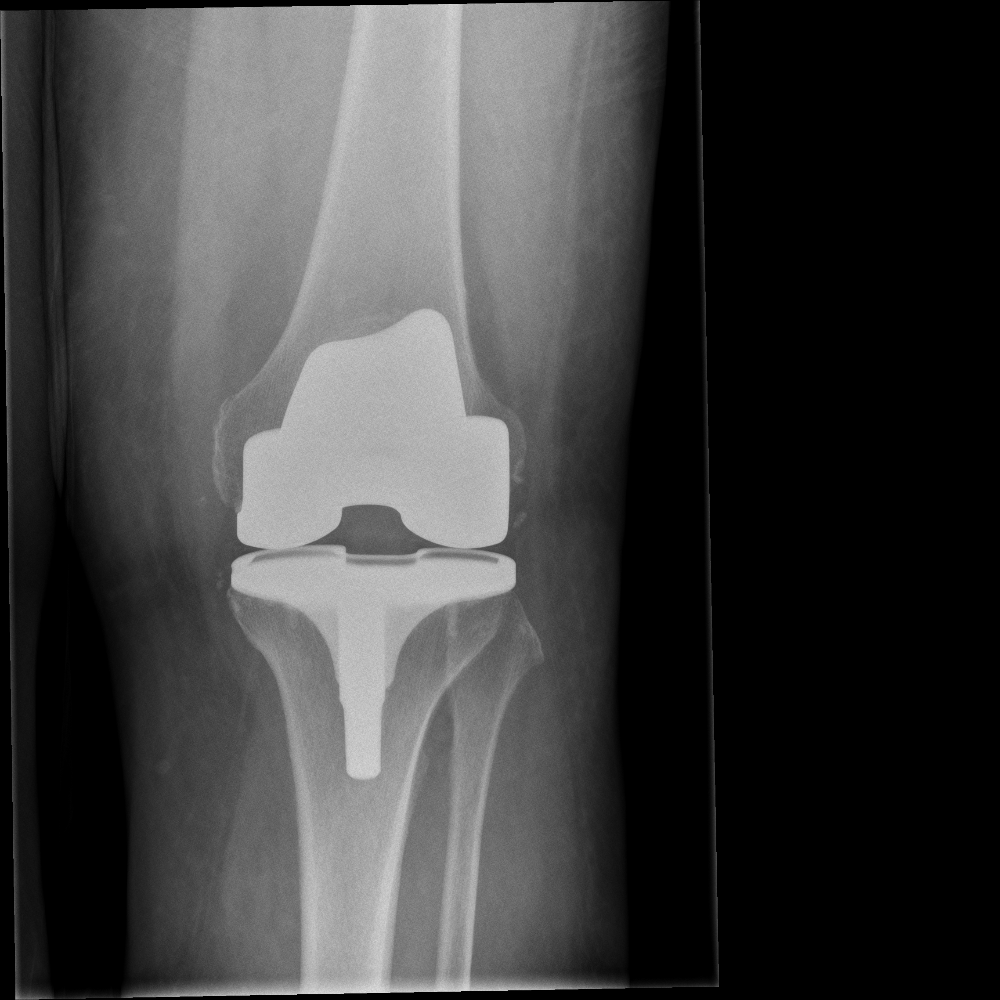
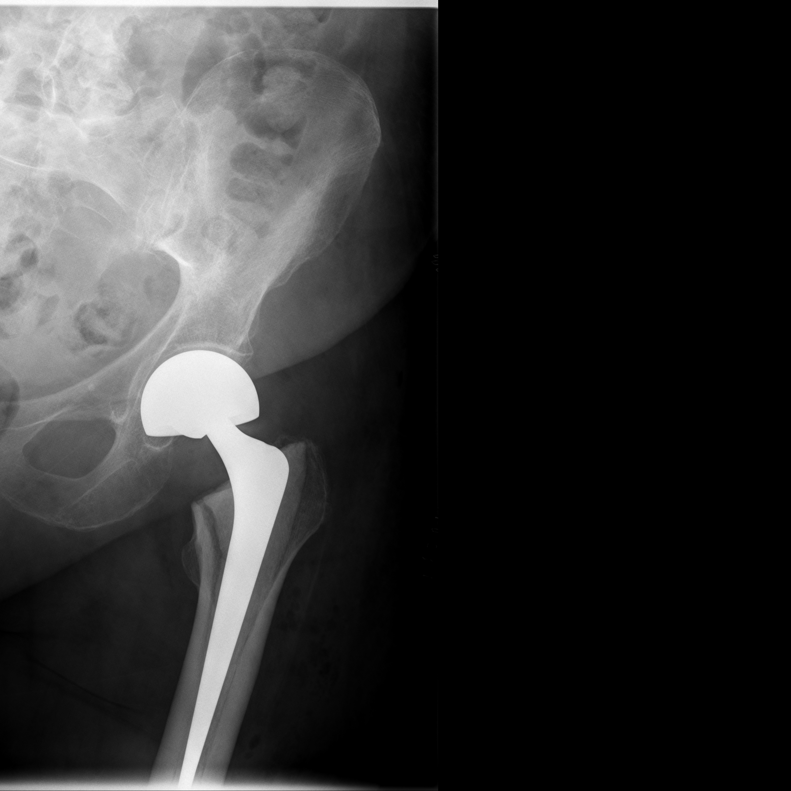
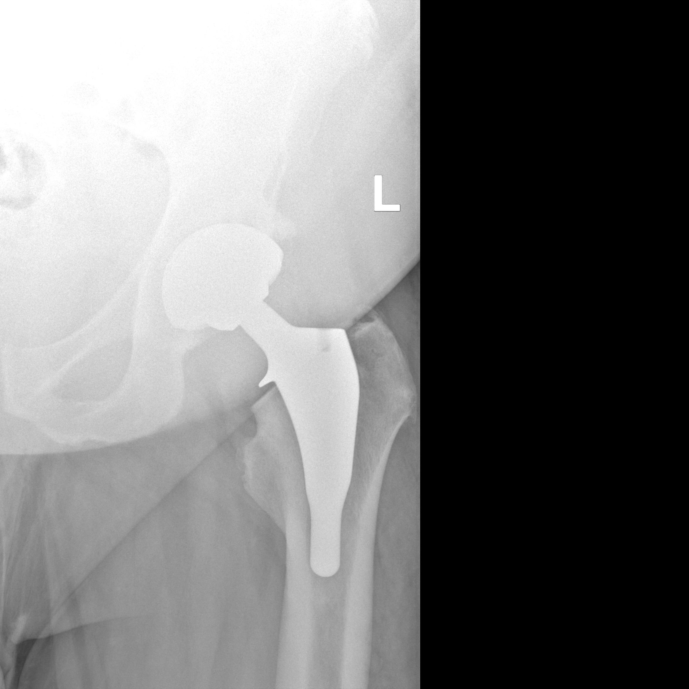
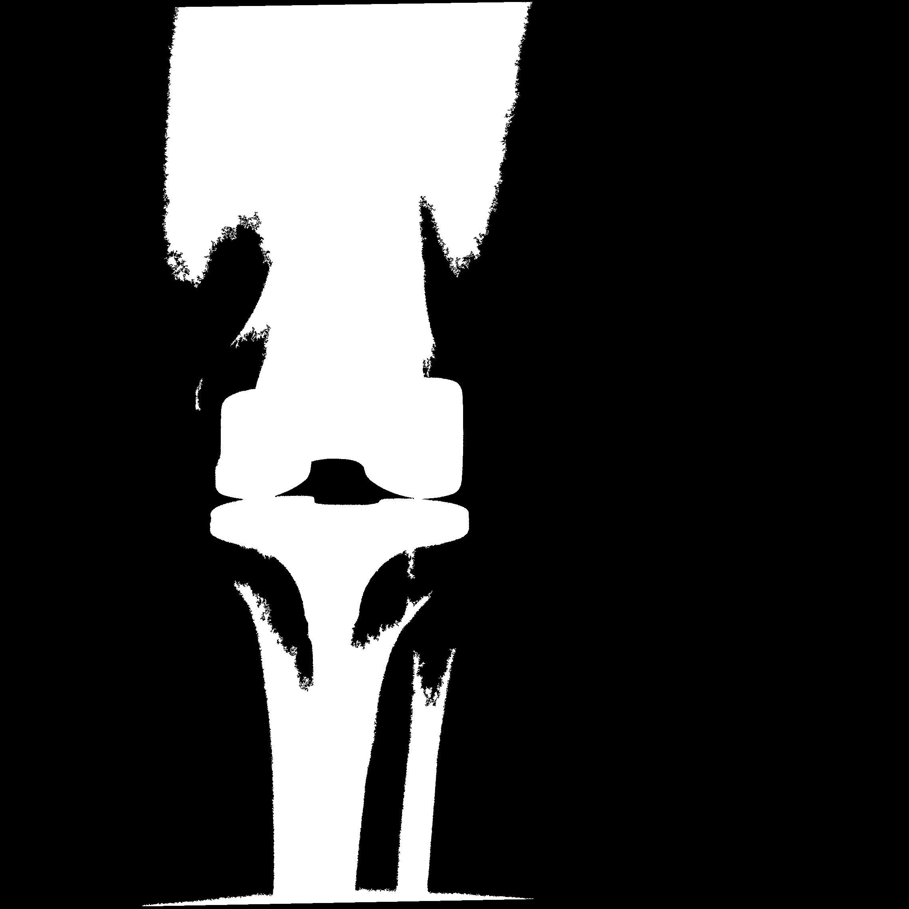
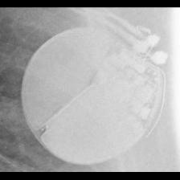

# Medical Vision-Language Learning for Implant Classification

<p align="center">
  
</p>

<p align="center">
  <strong>Vision Transformers • CLIP • Zero-Shot Learning • Prompt Learning • Medical Imaging</strong>
</p>

<p align="center">
  Exploring vision-language learning pipelines for orthopedic implant and pacemaker classification using supervised ViTs, zero-shot CLIP, and prompt adaptation methods.
</p>

<br>

# Overview

This repository explores vision-language learning approaches for medical implant classification using:

- Vision Transformers (ViTs)
- CLIP-based zero-shot inference
- Prompt learning methods
  - CoOp
  - CoCoOp
  - MaPLe

The project focuses on:
- orthopedic implant recognition
- pacemaker classification
- prompt adaptation for medical perception systems

The repository investigates:
- supervised learning
- zero-shot transfer
- prompt learning adaptation in specialized medical domains

---

# Dataset

## Orthopedic Implant Dataset

The orthopedic dataset contains:
- X-ray images
- segmentation masks
- implant labels
- patient identifiers

### Training CSV Structure

| Column Name | Description |
|---|---|
| filenames | X-ray image filename |
| labels | Implant class label |
| patient_id | Patient identifier |
| masks | Segmentation mask filename |
| valid_mask | Mask availability indicator |

### Sample Labels

| Example Implant Labels |
|---|
| Hip_SmithAndNephew_Polarstem_NilCol |
| Knee_SmithAndNephew_GenesisII |

<br>

## Pacemaker Dataset

### Train Set (45 Directories)

The training set contains between 20 and 35 examples per class.

### BIO

| Class | Files |
|---|---|
| Actros_Philos | 35 |
| Cyclos | 22 |
| Evia | 23 |

### BOS

| Class | Files |
|---|---|
| Altrua_Insignia | 35 |
| Autogen_Teligen_Energen_Cognis | 35 |
| Contak Renewal 4 | 35 |
| Contak Renewal TR2 | 34 |
| ContakTR_Discovery_Meridian_Pulsar Max | 35 |
| Emblem | 35 |
| Ingenio | 35 |
| Proponent | 35 |
| Ventak Prizm | 28 |
| Visionist | 35 |
| Vitality | 35 |

### MDT

| Class | Files |
|---|---|
| AT500 | 33 |
| Adapta_Kappa_Sensia_Versa | 35 |
| Advisa | 35 |
| Azure | 35 |
| C20_T20 | 35 |
| C60 DR | 35 |
| Claria_Evera_Viva | 35 |
| Concerto_Consulta_Maximo_Protecta_Secura | 35 |
| EnRhythm | 35 |
| Insync III | 35 |
| Maximo | 25 |
| REVEAL | 21 |
| REVEAL LINQ | 27 |
| Sigma | 35 |
| Syncra | 35 |
| Vita II | 24 |

### SOR

| Class | Files |
|---|---|
| Elect | 35 |
| Elect XS Plus | 25 |
| MiniSwing | 23 |
| Neway | 32 |
| Ovatio | 20 |
| Reply | 35 |
| Rhapsody_Symphony | 35 |
| Thesis | 31 |

### STJ

| Class | Files |
|---|---|
| Accent | 35 |
| Allure Quadra | 35 |
| Ellipse | 35 |
| Identity | 35 |
| Quadra Assura_Unify | 35 |
| Victory | 33 |
| Zephyr | 35 |

---

# Research Pipeline

<table align="center">
<tr>
<td align="center">
<br>
<sub>OrthoNet Zero-Shot CLIP Evaluation</sub>
</td>

<td align="center">
<br>
<sub>Pacemaker Zero-Shot CLIP Evaluation</sub>
</td>
</tr>
</table>

```text
Supervised ViTs
        ↓
Zero-Shot CLIP
        ↓
Prompt Learning Adaptation
(CoOp / CoCoOp / MaPLe)
```

---

# Dataset Examples

## Orthopedic Implant Samples

<p align="center">
  
  
  
  
</p>

<p align="center">
  <sub>Representative orthopedic implant radiographs from the OrthoNet dataset.</sub>
</p>

<br>

<p align="center">
  
  
  
  
</p>

<p align="center">
  <sub>Corresponding segmentation masks.</sub>
</p>

---

## Pacemaker Samples

<p align="center">
  
  
  
  
</p>

<p align="center">
  <sub>Sample pacemaker radiographs used for manufacturer-level classification experiments.</sub>
</p>

---

# Models Explored

## Vision Transformers

- ImageNet ViT
- CLIP ViT
- DINO ViT

## Vision-Language Models

- CLIP (ViT-B/32)

## Prompt Learning Methods

- CoOp
- CoCoOp
- MaPLe

---

# ViT Training Progress

## OrthoNet Experiments

<p align="center">
  
</p>

<br>

<p align="center">
  
</p>

<br>

<p align="center">
  
</p>

---

## Pacemaker Experiments

<p align="center">
  
</p>

<br>

<p align="center">
  
</p>

<br>

<p align="center">
  
</p>

---

# Zero-Shot CLIP Evaluation

<p align="center">
  
  
</p>

<p align="center">
  <sub>Zero-shot CLIP evaluation using prompt-based image-text similarity matching.</sub>
</p>

---

# Prompt Learning Results

<p align="center">
  
  
  
</p>

<p align="center">
  <sub>Prompt adaptation methods: CoOp, CoCoOp, and MaPLe.</sub>
</p>

---

# Stage 1 Manufacturer Classification

<p align="center">
  
</p>

---

# Dataset Note

The original datasets are not included in this repository due to size constraints.

The repository contains:
- sample medical images
- experiment outputs
- training curves
- evaluation results

to demonstrate the complete research pipeline.

---

# Installation

```bash
git clone https://github.com/Pratyay1010/vision-language-medical-classification.git

cd vision-language-medical-classification

pip install -r requirements.txt
```

---

# Training

## Train ViTs on OrthoNet

```bash
python scripts/train_orthonet_vit.py
```

## Train ViTs on Pacemaker Dataset

```bash
python scripts/train_pacemaker_vit.py
```

---

# Zero-Shot Evaluation

## OrthoNet

```bash
python scripts/zero_shot_orthonet.py
```

## Pacemaker

```bash
python scripts/zero_shot_pacemaker.py
```

---

# Prompt Learning

```bash
python scripts/prompt_learning_orthonet.py

python scripts/prompt_learning_pacemaker.py
```
