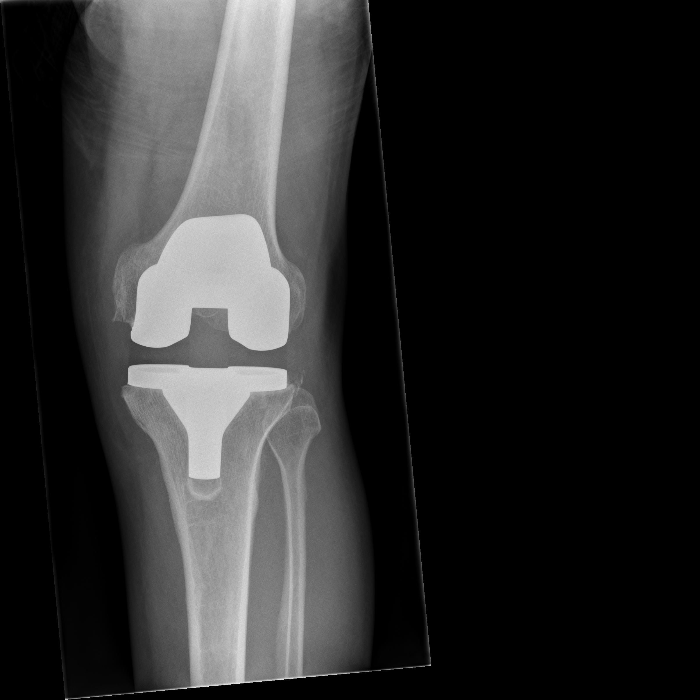
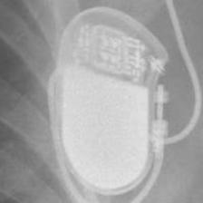
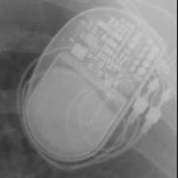
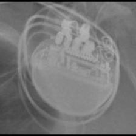

# Medical Vision-Language Learning for Implant Classification

<p align="center">
  
</p>

<p align="center">
  <strong>Vision Transformers • CLIP • Zero-Shot Learning • Prompt Learning • Medical Imaging</strong>
</p>

<p align="center">
  Vision-language learning pipelines for orthopedic implant and pacemaker classification using supervised ViTs, zero-shot CLIP, and prompt adaptation methods.
</p>


# Overview

This repository explores medical vision-language learning approaches for:

- orthopedic implant recognition
- pacemaker classification
- prompt-based medical perception

The project investigates:
- supervised Vision Transformers
- CLIP-based zero-shot inference
- prompt learning adaptation in specialized medical domains

Implemented methods include:
- ImageNet ViT
- CLIP ViT
- DINO ViT
- CoOp
- CoCoOp
- MaPLe


# Dataset

## Orthopedic Implant Dataset

The orthopedic dataset contains:
- X-ray images
- segmentation masks
- implant labels
- patient identifiers

### Training CSV Structure

| Column Name | Description |
|||
| filenames | X-ray image filename |
| labels | Implant class label |
| patient_id | Patient identifier |
| masks | Segmentation mask filename |
| valid_mask | Mask availability indicator |

### Example Implant Labels

- Hip_SmithAndNephew_Polarstem_NilCol
- Knee_SmithAndNephew_GenesisII

<br>

## Pacemaker Dataset

The pacemaker dataset contains manufacturer-level and model-level radiographs organized into subdirectories.

The dataset includes:
- 45+ device categories
- manufacturer-specific subclasses
- varying implant orientations
- real-world X-ray imaging conditions

Manufacturers represented include:
- BIO
- BOS
- MDT
- SOR
- STJ


# Research Pipeline

<p align="center">
  
  
</p>

```text
Supervised ViTs
        ↓
Zero-Shot CLIP
        ↓
Prompt Learning Adaptation
```


# Dataset Examples

## Orthopedic Implant Samples

<p align="center">
  
  
</p>

<p align="center">
  <sub>X-ray image and corresponding segmentation mask.</sub>
</p>


## Pacemaker Samples

<p align="center">
  
  
  
</p>

<p align="center">
  <sub>Representative pacemaker radiographs used for manufacturer-level classification.</sub>
</p>


# Models Explored

## Vision Transformers
- ImageNet ViT
- CLIP ViT
- DINO ViT

## Vision-Language Models
- CLIP (ViT-B/32)

## Prompt Learning
- CoOp
- CoCoOp
- MaPLe


# Key Results

<p align="center">
  
</p>

<br>

<p align="center">
  
  
</p>


# Dataset Note

The original datasets are not included in this repository due to size constraints.

This repository contains:
- sample medical images
- experiment outputs
- training visualizations
- evaluation results

to demonstrate the complete research pipeline.


# Installation

```bash
git clone https://github.com/Pratyay1010/vision-language-medical-classification.git

cd vision-language-medical-classification

pip install -r requirements.txt
```


# Training

## Train ViTs on OrthoNet

```bash
python scripts/train_orthonet_vit.py
```

## Train ViTs on Pacemaker Dataset

```bash
python scripts/train_pacemaker_vit.py
```


# Zero-Shot Evaluation

```bash
python scripts/zero_shot_orthonet.py

python scripts/zero_shot_pacemaker.py
```


# Prompt Learning

```bash
python scripts/prompt_learning_orthonet.py

python scripts/prompt_learning_pacemaker.py
```


# Features

- Modular research-oriented codebase
- Reusable datasets and evaluation utilities
- Vision-language learning workflows
- Zero-shot CLIP evaluation
- Prompt learning experimentation
- Medical imaging focus
