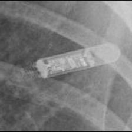

# Medical Vision-Language Learning for Implant Classification

<p align="center">
  
</p>

<p align="center">
  <strong>Vision Transformers • CLIP • Zero-Shot Learning • Prompt Learning • Medical Imaging</strong>
</p>

<p align="center">
  Exploring vision-language learning pipelines for orthopedic implant and pacemaker classification using supervised ViTs, zero-shot CLIP, and prompt adaptation methods.
</p>

# Overview

This repository explores vision-language learning approaches for medical implant classification using:

- Vision Transformers (ViTs)
- CLIP-based zero-shot inference
- Prompt learning methods
  - CoOp
  - CoCoOp
  - MaPLe

The project focuses on:
- orthopedic implant recognition
- pacemaker classification
- prompt adaptation for medical perception systems

The repository investigates:
- supervised learning
- zero-shot transfer
- prompt learning adaptation in specialized medical domains

# Dataset

## Orthopedic Implant Dataset

The orthopedic dataset contains:
- X-ray images
- segmentation masks
- implant labels
- patient identifiers

### Training CSV Columns

- filenames
- labels
- patient_id
- masks
- valid_mask

### Sample Labels

- Hip_SmithAndNephew_Polarstem_NilCol
- Knee_SmithAndNephew_GenesisII

---

## Pacemaker Dataset

### Train (45 directories)

The training set contains between 20 and 35 examples per class.

#### BIO

- Actros_Philos — 35 files
- Cyclos — 22 files
- Evia — 23 files

#### BOS

- Altrua_Insignia — 35 files
- Autogen_Teligen_Energen_Cognis — 35 files
- Contak Renewal 4 — 35 files
- Contak Renewal TR2 — 34 files
- ContakTR_Discovery_Meridian_Pulsar Max — 35 files
- Emblem — 35 files
- Ingenio — 35 files
- Proponent — 35 files
- Ventak Prizm — 28 files
- Visionist — 35 files
- Vitality — 35 files

#### MDT

- AT500 — 33 files
- Adapta_Kappa_Sensia_Versa — 35 files
- Advisa — 35 files
- Azure — 35 files
- C20_T20 — 35 files
- C60 DR — 35 files
- Claria_Evera_Viva — 35 files
- Concerto_Consulta_Maximo_Protecta_Secura — 35 files
- EnRhythm — 35 files
- Insync III — 35 files
- Maximo — 25 files
- REVEAL — 21 files
- REVEAL LINQ — 27 files
- Sigma — 35 files
- Syncra — 35 files
- Vita II — 24 files

#### SOR

- Elect — 35 files
- Elect XS Plus — 25 files
- MiniSwing — 23 files
- Neway — 32 files
- Ovatio — 20 files
- Reply — 35 files
- Rhapsody_Symphony — 35 files
- Thesis — 31 files

#### STJ

- Accent — 35 files
- Allure Quadra — 35 files
- Ellipse — 35 files
- Identity — 35 files
- Quadra Assura_Unify — 35 files
- Victory — 33 files
- Zephyr — 35 files

# Research Pipeline

<p align="center">
  
  
</p>

```text
Supervised ViTs
        ↓
Zero-Shot CLIP
        ↓
Prompt Learning Adaptation
(CoOp / CoCoOp / MaPLe)
```

# Dataset Examples

## Orthopedic Implant Samples

<p align="center">
  
  
  
  
</p>

<p align="center">
  
  
  
  
</p>

<p align="center">
  <sub>Sample orthopedic implant X-rays and segmentation masks.</sub>
</p>

## Pacemaker Samples

<p align="center">
  
  
  
  
  
</p>

<p align="center">
  <sub>Sample pacemaker X-ray images used for manufacturer-level classification experiments.</sub>
</p>

# Models Explored

## Vision Transformers

- ImageNet ViT
- CLIP ViT
- DINO ViT

## Vision-Language Models

- CLIP (ViT-B/32)

## Prompt Learning Methods

- CoOp
- CoCoOp
- MaPLe

# ViT Training Progress

## OrthoNet Experiments

<p align="center">
  
</p>

<p align="center">
  
</p>

<p align="center">
  
</p>

## Pacemaker Experiments

<p align="center">
  
</p>

<p align="center">
  
</p>

<p align="center">
  
</p>

# Zero-Shot CLIP Evaluation

<p align="center">
  
  
</p>

CLIP was evaluated without task-specific fine-tuning using prompt-based image-text similarity matching.

# Prompt Learning Results

<p align="center">
  
  
  
</p>

Prompt adaptation methods explored:
- CoOp
- CoCoOp
- MaPLe

for improving medical domain alignment and classification performance.

# Stage 1 Manufacturer Classification

<p align="center">
  
</p>

# Dataset Note

The original datasets are not included in this repository due to size constraints.

The repository contains:
- sample medical images
- experiment outputs
- training curves
- evaluation results

to demonstrate the complete research pipeline.

# Installation

```bash
git clone https://github.com/Pratyay1010/vision-language-medical-classification.git

cd your-repo-name

pip install -r requirements.txt
```

# Training

## Train ViTs on OrthoNet

```bash
python scripts/train_orthonet_vit.py
```

## Train ViTs on Pacemaker Dataset

```bash
python scripts/train_pacemaker_vit.py
```

# Zero-Shot Evaluation

## OrthoNet

```bash
python scripts/zero_shot_orthonet.py
```

## Pacemaker

```bash
python scripts/zero_shot_pacemaker.py
```

# Prompt Learning

```bash
python scripts/prompt_learning_orthonet.py

python scripts/prompt_learning_pacemaker.py
```
