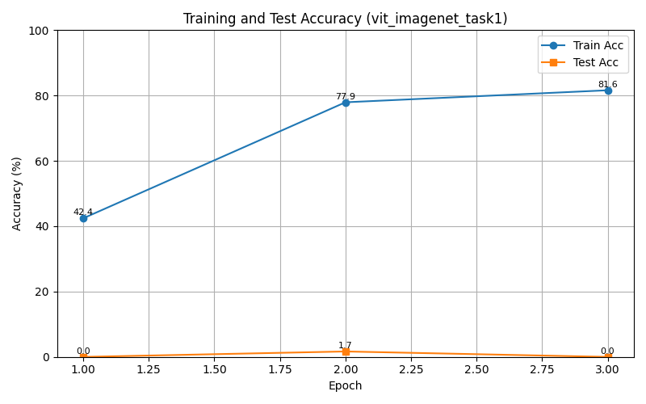
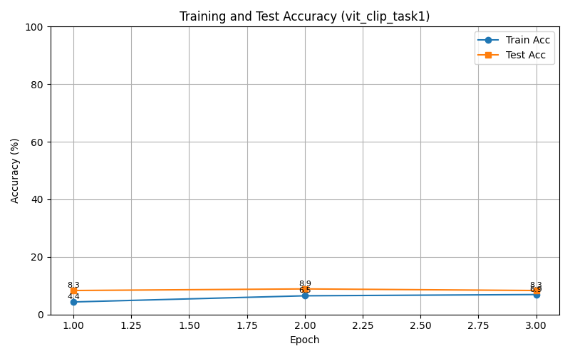
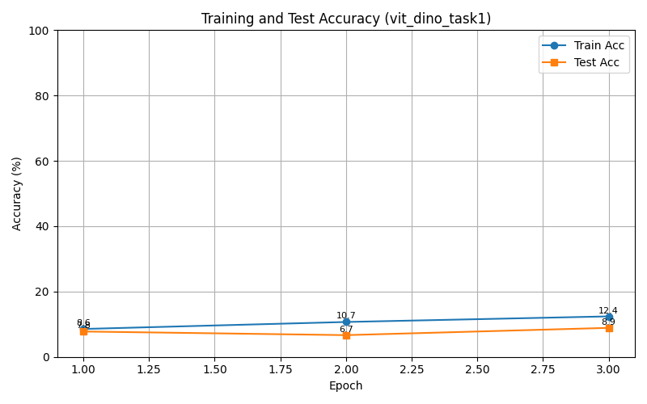
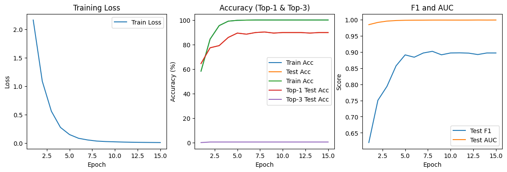
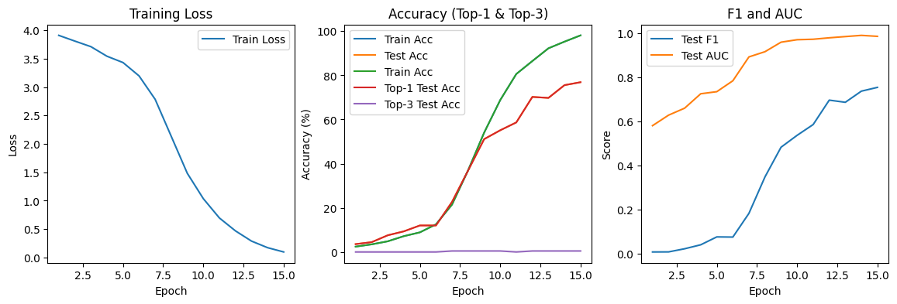
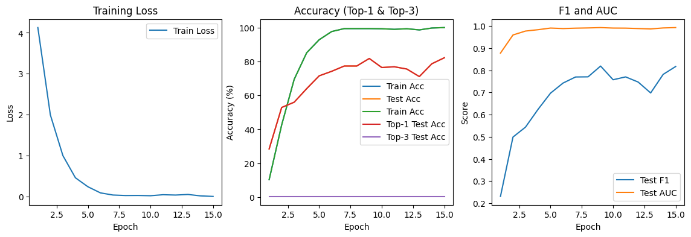
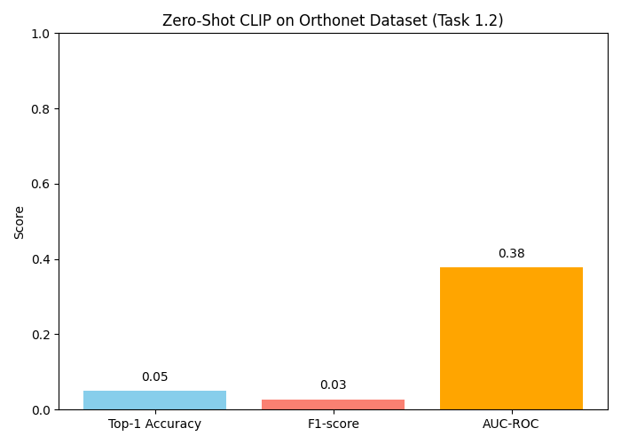
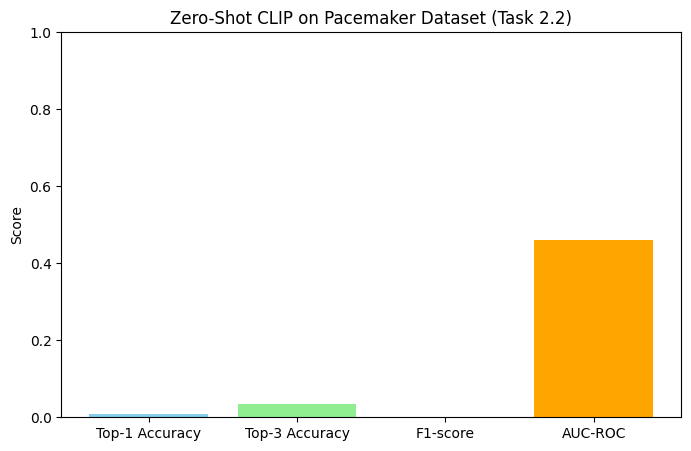
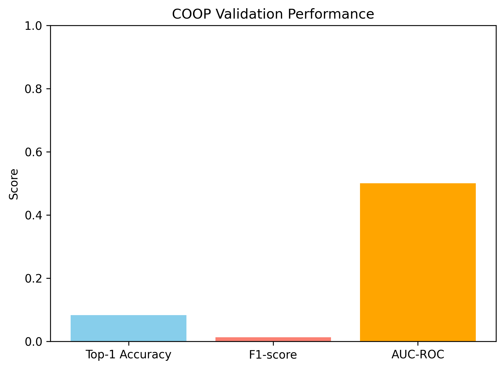
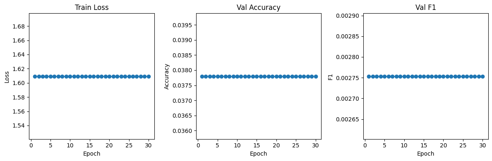

# Medical Vision-Language Learning for Implant Classification


# Overview

This repository explores medical vision-language learning approaches for:

- Orthopedic implant classification
- Pacemaker manufacturer classification
- Zero-shot medical image understanding
- Prompt learning adaptation

Methods explored:
- Vision Transformers (ViTs)
- CLIP zero-shot learning
- Prompt learning methods
  - CoOp
  - CoCoOp
  - MaPLe


# Dataset

## Orthopedic Implant Dataset

The orthopedic dataset contains:

- X-ray images
- Implant labels
- Segmentation masks
- Patient identifiers

### Training CSV Structure

| Column | Description |
|||
| filenames | X-ray image filename |
| labels | Implant class label |
| patient_id | Patient identifier |
| masks | Segmentation mask filename |
| valid_mask | Mask availability |

### Sample Labels

- Hip_SmithAndNephew_Polarstem_NilCol
- Knee_SmithAndNephew_GenesisII

### Dataset Size

- Total training samples: 1169


## Pacemaker Dataset

### Training Set

The pacemaker training dataset contains between 20 and 35 images per class.

### Manufacturer Classes

| Manufacturer | Model Groups |
|||
| BIO | Actros_Philos, Cyclos, Evia |
| BOS | Altrua_Insignia, Autogen_Teligen_Energen_Cognis, Contak Renewal 4, Contak Renewal TR2, Emblem, Ingenio, Proponent, Ventak Prizm, Visionist, Vitality |
| MDT | AT500, Advisa, Azure, Claria_Evera_Viva, EnRhythm, Sigma, Syncra |
| SOR | Elect, Elect XS Plus, MiniSwing, Neway, Ovatio, Reply, Thesis |
| STJ | Accent, Allure Quadra, Ellipse, Identity, Victory, Zephyr |

### Example Class Counts

| Class | Files |
|||
| BIO - Actros_Philos | 35 |
| BIO - Cyclos | 22 |
| BOS - Emblem | 35 |
| MDT - Azure | 35 |
| MDT - REVEAL | 21 |
| SOR - Ovatio | 20 |
| STJ - Accent | 35 |
| STJ - Victory | 33 |


# Research Pipeline

```text
Dataset Preparation
        ↓
Supervised ViT Training
        ↓
Zero-Shot CLIP Evaluation
        ↓
Prompt Learning Adaptation
(CoOp / CoCoOp / MaPLe)
```


# Models Explored

## Vision Transformers

- ImageNet ViT
- CLIP ViT
- DINO ViT

## Vision-Language Models

- CLIP (ViT-B/32)

## Prompt Learning Methods

- CoOp
- CoCoOp
- MaPLe


# Experimental Results

## OrthoNet ViT Experiments

<p align="center">
  
</p>

<p align="center">
  
</p>

<p align="center">
  
</p>


## Pacemaker ViT Experiments

<p align="center">
  
</p>

<p align="center">
  
</p>

<p align="center">
  
</p>


# Zero-Shot CLIP Evaluation

<p align="center">
  
  
</p>

CLIP was evaluated without task-specific fine-tuning using prompt-based image-text similarity matching.


# Prompt Learning Results

<p align="center">
  
  
  
</p>

Methods explored:
- CoOp
- CoCoOp
- MaPLe


# Stage 1 Manufacturer Classification

<p align="center">
  
</p>


# Installation

```bash
git clone https://github.com/Pratyay1010/vision-language-medical-classification.git

cd your-repo-name

pip install -r requirements.txt
```


# Training

## Train ViTs on OrthoNet

```bash
python scripts/train_orthonet_vit.py
```

## Train ViTs on Pacemaker Dataset

```bash
python scripts/train_pacemaker_vit.py
```


# Zero-Shot Evaluation

## OrthoNet

```bash
python scripts/zero_shot_orthonet.py
```

## Pacemaker

```bash
python scripts/zero_shot_pacemaker.py
```


# Prompt Learning

```bash
python scripts/prompt_learning_orthonet.py

python scripts/prompt_learning_pacemaker.py
```
